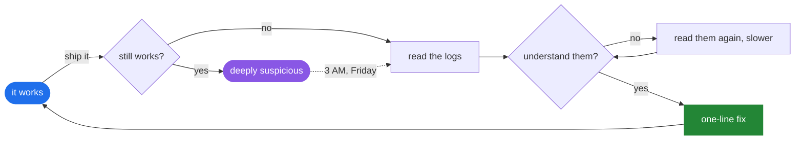

  

## The actual workflow

 

## The streak

<picture>
  <source media="(prefers-color-scheme: dark)" srcset="https://github-readme-streak-stats.herokuapp.com/?user=rahul0xcdf&theme=tokyonight&hide_border=true&background=0D1117&ring=1F6FEB&fire=8957E5&currStreakLabel=1F6FEB" />
  <source media="(prefers-color-scheme: light)" srcset="https://github-readme-streak-stats.herokuapp.com/?user=rahul0xcdf&theme=default&hide_border=true&ring=1F6FEB&fire=8957E5&currStreakLabel=1F6FEB" />
  
</picture>

  

 

 

## The snake eats it all

  

 

